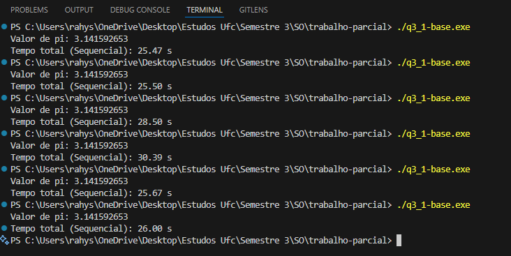

# Trabalho Parcial de Sistemas Operacionais ⚙️
O presente trabalho faz parte da entrega da disciplina de sistemas operacionais, o objetivo foi aprimorar o conhecimento acerca de threads, semáforo, multex e buffer.

## Detalhes 📌
* Na pasta documents, está presente o documento que contém a explicação das questões.
* A "questao1" representa a questão 1 com 3 produtoras e 1 consumidora. Já a "questao1g" representa a versão com 6 produtoras e 2 consumidoras.

### Tempo de Execução Sequencial - Questão 2
