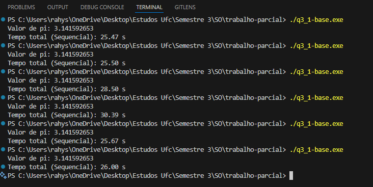

##Dúvidas sobre o trabalho
1.Na nossa primeira questão, alguns dos valores aleatórios que estamos usando, ao longo da execução, vão se repetindo. Há algum problema nisso? Isso indica algum tipo de falha? ou não?
2.Ao fazer a parte sequencial da questão dois, notamos uma diferença significativa entre o uso de int e long long. Nesse caso, qual das duas você acha melhor usar?
###Tempo com uso de long long

###Tempo com uso de int e, no fim, long long
